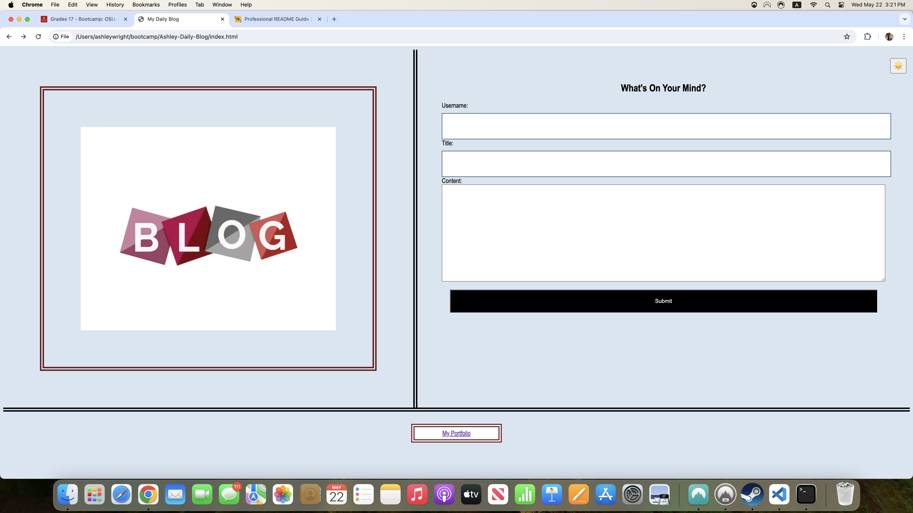
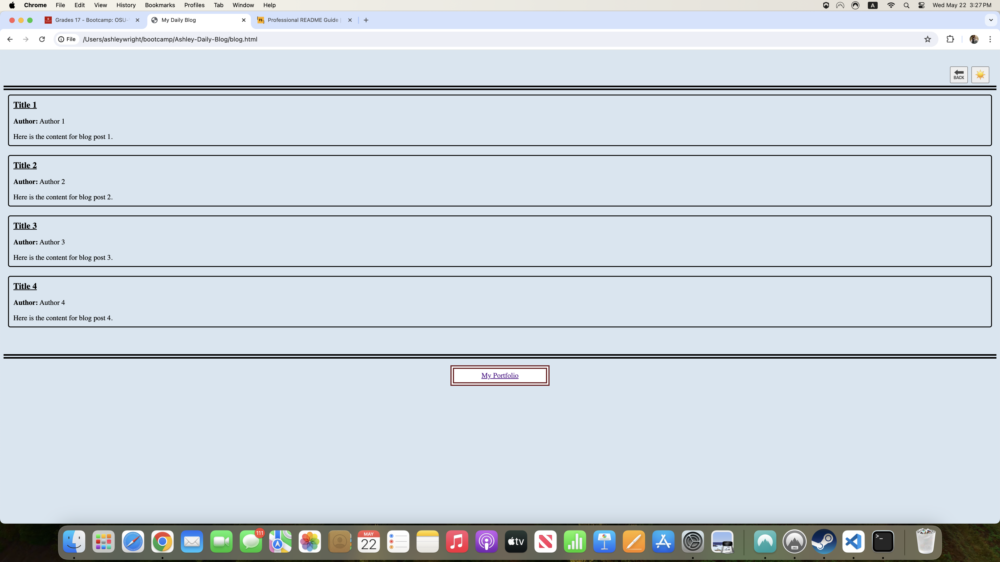

# My Daily Blog

## Description

I created this web application to become an easily accessible hub for all of my daily blog posts that I want to write. Rather than having them in a physical book, this will allow me to kepp them all stored on the same page to easily go back and re-read them and see how far I have come in my web development journey. I plan to use this site throughout the remainder of my time in this course to keep track of the topics that I find I have more problems with and to remind myself just how far I have come in this course. This project taught me patience more than anything as well as learning when I need to step away to recenter my mind and try to attack any problems from a new headspace. There were plenty of times in this project that I had small details wrong that broke my code and I had to figure out where those problems existed, and that patience was something I really had not worked on before this course.

## Usage

To use this web application, just enter your name in the username field, your blog title in the title field, and write to your hearts content in the content field. When you are finished, just hit the submit button, and you will be redirected to the posts page where you will see all of your blog posts in one location.

```md

```

```md

```

Here is the link to my deployed page: https://ajwmp93.github.io/Ashley-Daily-Blog/index.html

## Credits

Valentina Strizheus (https://github.com/valyastriz) was incredibly helpful in sharing some of her code with me to help me get the light mode/dark mode toggle to work on my page and XPert Learning Assistant (https://bootcampspot.instructure.com/courses/5617/external_tools/313) helped debug when I got stuck. 